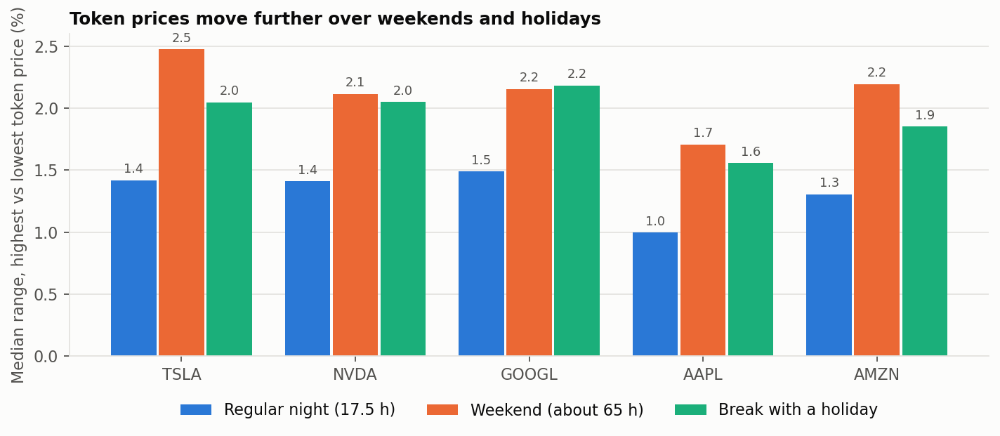
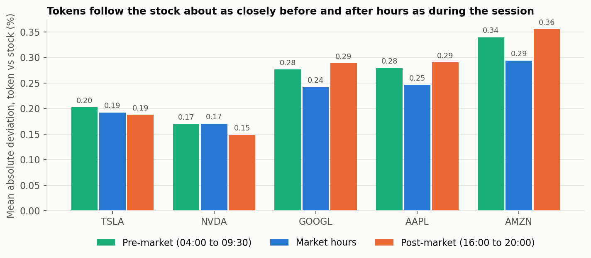

# Tokenisierte Aktien auf Solana vs. Nasdaq: Preisverhalten außerhalb der US-Börsenzeiten

[English](README.md) | **Deutsch**

**Tesla, Nvidia, Alphabet, Apple und Amazon · 8. Juli 2025 bis 30. September 2026**

**[Interaktives Dashboard öffnen](https://tokenized-vs-nasdaq-stocks-after-hours-bpasxc8wni65acwxnmkscb.streamlit.app/)** (Deutsch und Englisch)

## Worum es in diesem Projekt geht

Die reguläre Handelssitzung der Nasdaq läuft an Werktagen von 9:30 bis 16:00 Uhr New Yorker Zeit. In den 15 Monaten, die hier untersucht werden, war die Börse 81 % der Zeit geschlossen: jede Nacht, jedes Wochenende und jeden Feiertag. (Die Aktien werden zwar auch in einer dünnen Vor- und Nachbörse gehandelt, die offiziellen Eröffnungs- und Schlusskurse stammen aber aus der regulären Sitzung.) Tokenisierte Versionen derselben Aktien, die sogenannten xStocks, werden dagegen rund um die Uhr auf der Solana-Blockchain gehandelt. Ihr Preis bewegt sich also weiter, auch wenn die Börse zu ist.

Dieses Projekt vergleicht fünf tokenisierte Aktien mit ihren Nasdaq-Aktien und fragt, was der Token-Preis in einer **Börsenpause** macht: der Zeit von einer Schlussglocke bis zur nächsten Eröffnungsglocke, also einer Nacht, einem Wochenende oder einer Pause rund um einen Feiertag. Die zentrale Frage ist, ob der Token-Preis die Nachrichten der Börsenpause schon enthält und so zeigt, wo die Aktie am nächsten Morgen eröffnet. Zwei weitere Fragen schließen sich an: ob sich daraus ein Gewinn machen lässt und zu welcher Zeit der Nacht sich der Preis anpasst.

Das Projekt richtet sich an zwei Gruppen: an Leser vom Aktienmarkt, die noch nie eine Blockchain benutzt haben, und an Leser aus der Krypto-Welt, die wissen wollen, wie eng diese Token dem echten Markt folgen. Begriffe aus beiden Welten werden dort erklärt, wo sie zum ersten Mal vorkommen, und das Dashboard enthält ein Glossar.

Die vollständige Analyse steht im Notebook `tokenized_vs_nasdaq_after_hours.ipynb`, und im Dashboard lässt sich jede einzelne Börsenpause ansehen. Diese Seite liefert den Hintergrund, die Methode und die Ergebnisse.

## Das Ergebnis in Kürze

Der Token-Preis ist ein guter Frühindikator für den Eröffnungskurs, aber keine Quelle für leichte Gewinne.

Während die Nasdaq geschlossen ist, bewegt sich der Token-Markt weiter: Die Preisspanne beträgt im Median 1,0 % bis 1,5 % in einer normalen Nacht und 1,7 % bis 2,5 % über ein Wochenende. Diese Bewegungen sind kein Rauschen. Die Bewegung des Tokens in einer Börsenpause korreliert mit 0,88 bis 0,96 mit dem Sprung der Aktie von Schluss zu Eröffnung, und wo die Aktie um mindestens 0,5 % sprang, war der Token in 95 % bis 99 % der Fälle in dieselbe Richtung gelaufen. Der letzte Token-Preis vor der Eröffnung verfehlt den echten Eröffnungskurs im Median um 0,18 % bis 0,30 %. Das ist bei Tesla und Nvidia deutlich besser als der Schlusskurs vom Vortag und bei Apple nur knapp besser. Die Anpassung passiert vor allem in den letzten Stunden vor der Eröffnung, in denen die Aktie selbst schon in der Vorbörse gehandelt wird.

Beim Schluss den Token zu kaufen und nach der Eröffnung zu verkaufen, bringt vor Kosten 0,06 % bis 0,18 % je Börsenpause, etwa so viel, wie die Aktien selbst von Schluss zu Eröffnung gewannen. Über alle Börsenpausen gerechnet macht ein Hin-und-zurück-Kostensatz von 0,3 % daraus bei allen fünf Token einen Verlust. Solange die Nasdaq offen ist, weichen die Token im Durchschnitt nur 0,17 % bis 0,29 % vom Aktienkurs ab, und der dünnste Token, Amazon, folgt am schlechtesten.

Die sieben Fragen hinter diesen Ergebnissen werden im [Ergebnisteil](#ergebnisse-die-sieben-fragen) einzeln beantwortet.

## Hintergrund: die Token

### Was xStocks sind und wer sie herausgibt

Alle fünf Token sind **xStocks**, herausgegeben von Backed Assets (JE) Limited, einer Gesellschaft mit beschränkter Haftung auf Jersey [2][3]. Backed kauft die echten Aktien über Broker, hinterlegt sie bei einem regulierten Verwahrer und gibt je Aktie einen Token aus [1]. Jeder xStock ist deshalb 1:1 durch die zugrunde liegende Aktie gedeckt [2]. Ein Token gibt die Preisentwicklung wieder, macht aber niemanden zum Aktionär: Halter besitzen die Aktien nicht und haben weder Stimmrechte noch Ansprüche gegen das Unternehmen [2]. xStocks sind in den USA und für US-Personen nicht verfügbar, ebenso nicht in Kanada, Großbritannien und Australien [2][3].

xStocks starteten am 30. Juni 2025 auf Solana mit mehr als 55 tokenisierten Aktien und ETFs [1]; dieses Datum ist der früheste mögliche Beginn der Daten. Sie werden an zentralen Börsen wie Kraken und Bybit gehandelt und an dezentralen Börsen auf Solana wie Raydium, die über den Aggregator Jupiter erreichbar sind [1]. Dieses Projekt nutzt nur dezentrale Trades. Am 2. Dezember 2025 gab Kraken bekannt, die Übernahme von Backed vereinbart zu haben, dem Unternehmen hinter xStocks [4].

xStocks sind nicht die einzigen tokenisierten Aktien auf Solana; auch Ondo Global Markets bietet dort zum Beispiel tokenisierte US-Aktien an [10]. Andere Emittenten sind nicht Teil dieses Projekts.

### Die fünf Token

| Token | Mint-Adresse auf Solana | Aktie | Ticker | Börse | ISIN der Aktie |
|---|---|---|---|---|---|
| TSLAx | [`XsDoVfqeBukxuZHWhdvWHBhgEHjGNst4MLodqsJHzoB`](https://solscan.io/token/XsDoVfqeBukxuZHWhdvWHBhgEHjGNst4MLodqsJHzoB) | Tesla, Inc. | TSLA | Nasdaq | US88160R1014 |
| NVDAx | [`Xsc9qvGR1efVDFGLrVsmkzv3qi45LTBjeUKSPmx9qEh`](https://solscan.io/token/Xsc9qvGR1efVDFGLrVsmkzv3qi45LTBjeUKSPmx9qEh) | NVIDIA Corporation | NVDA | Nasdaq | US67066G1040 |
| GOOGLx | [`XsCPL9dNWBMvFtTmwcCA5v3xWPSMEBCszbQdiLLq6aN`](https://solscan.io/token/XsCPL9dNWBMvFtTmwcCA5v3xWPSMEBCszbQdiLLq6aN) | Alphabet Inc., Class A | GOOGL | Nasdaq | US02079K3059 |
| AAPLx | [`XsbEhLAtcf6HdfpFZ5xEMdqW8nfAvcsP5bdudRLJzJp`](https://solscan.io/token/XsbEhLAtcf6HdfpFZ5xEMdqW8nfAvcsP5bdudRLJzJp) | Apple Inc. | AAPL | Nasdaq | US0378331005 |
| AMZNx | [`Xs3eBt7uRfJX8QUs4suhyU8p2M6DoUDrJyWBa8LLZsg`](https://solscan.io/token/Xs3eBt7uRfJX8QUs4suhyU8p2M6DoUDrJyWBa8LLZsg) | Amazon.com, Inc. | AMZN | Nasdaq | US0231351067 |

Die Mint-Adresse ist die eindeutige Adresse eines Tokens auf Solana. Die fünf Adressen stehen in der Fallstudie der Solana Foundation zu xStocks [1], und Börse, Ticker und ISIN der Aktien stammen aus Unternehmensprofilen bei StockAnalysis [6]. Der Alphabet-Token bildet die Class-A-Aktie (GOOGL) ab, nicht die Class-C-Aktie (GOOG) [11].

Die Token werden unterschiedlich stark gehandelt. Im Analysezeitraum ergeben ihre Trades gegen US-Dollar-Stablecoins auf den dezentralen Börsen von Solana folgende Summen (eigene Dune-Daten). Eine halbe Stunde hat einen Preis, wenn in ihr mindestens ein Stablecoin-Trade stattfand und der Preis nicht als Ausreißer markiert wurde (siehe [Von den Trades zu den Preisen](#von-den-trades-zu-den-preisen)).

| Token | Trades | Volumen (Mio. USD) | Halbe Stunden mit Preis |
|---|---|---|---|
| TSLAx | 3.213.000 | 608,9 | 100,0 % |
| NVDAx | 3.950.211 | 537,7 | 99,9 % |
| GOOGLx | 767.548 | 103,3 | 97,1 % |
| AAPLx | 532.211 | 55,1 | 94,3 % |
| AMZNx | 313.809 | 37,2 | 87,0 % |

### Warum diese fünf Token

Die fünf Token sind nicht von Hand ausgesucht. Sie ergeben sich aus zwei Regeln, angewendet auf jeden Token, dessen Mint-Adresse auf Solana mit `Xs` beginnt, dem Präfix von xStocks. Die Monatsübersicht aus Dune führt 145 Symbole mit Trades ab Juli 2025 auf; einige davon sind fremde Token mit demselben Präfix.

Die erste Regel ist durchgehender Handel: mindestens 5.000 Trades in jedem Monat von Juli 2025 bis September 2026, damit ein Token über den ganzen Zeitraum eine brauchbare Preisreihe hat. Die zweite Regel ist eine bekannte Einzelfirma ohne Krypto-Bezug, damit auch Leser außerhalb der Krypto-Szene dem Vergleich folgen können. Die erste Regel lässt zehn Token übrig. Die zweite entfernt zwei ETFs (SPYx, QQQx) und drei krypto-nahe Unternehmen (Circle, Strategy, Robinhood). Robinhood ist ein Broker mit großem Krypto-Geschäft, der Ausschluss ist deshalb eine Ermessensentscheidung.

| Token | Basiswert | Niedrigste Trades in einem Monat | Volumen (Mio. USD) | Entscheidung |
|---|---|---|---|---|
| SPYx | S&P-500-ETF | 110.739 | 2.684,0 | ausgeschlossen: ETF |
| CRCLx | Circle | 56.522 | 1.187,8 | ausgeschlossen: krypto-nah |
| NVDAx | Nvidia | 96.190 | 750,9 | **gewählt** |
| TSLAx | Tesla | 164.118 | 730,5 | **gewählt** |
| QQQx | Nasdaq-100-ETF | 18.174 | 352,8 | ausgeschlossen: ETF |
| MSTRx | Strategy | 43.736 | 310,5 | ausgeschlossen: krypto-nah |
| GOOGLx | Alphabet | 41.533 | 138,1 | **gewählt** |
| HOODx | Robinhood | 6.063 | 90,8 | ausgeschlossen: krypto-nah |
| AAPLx | Apple | 18.036 | 83,2 | **gewählt** |
| AMZNx | Amazon | 8.413 | 53,1 | **gewählt** |

Volumen: alle dezentralen Trades, Juli 2025 bis September 2026. Der Export lässt Gruppen mit weniger als 100 Trades je Monat, Handelsort und Gebührenstufe weg, die Zahlen sind deshalb leicht zu niedrig.

Zwei Kandidaten wurden zuerst erwogen und verworfen, weil sie 2025 kaum gehandelt wurden. MSFTx (Microsoft) hatte im Juli 2025 keinen einzigen Trade und erreichte erst im März 2026 zum ersten Mal 5.000 Trades im Monat. MCDx (McDonald's) hatte im Juli 2025 102 Trades und erreichte diese Marke ebenfalls erst im März 2026 zum ersten Mal.

### Wo die Token gehandelt werden

Solana dominiert den On-Chain-Handel mit tokenisierten Aktien: Im Juni 2026 entfielen laut SolanaFloor rund 94 % bis 96 % des Handelsvolumens über alle Blockchains auf Solana [7]. Deshalb nutzt das Projekt Solana und nicht Ethereum.

Der Markt ist im Analysezeitraum stark gewachsen. Das monatliche dezentrale Volumen aller Token in der Übersichtsabfrage stieg von 114 Mio. USD im Juli 2025 auf 518 Mio. USD im August 2026. Zwei Monate liegen weit über diesem Trend: Juni 2026 mit 2.290 Mio. USD und September 2026 mit 2.105 Mio. USD (eigene Dune-Daten).

An einer dezentralen Börse (DEX) tauscht ein Händler gegen einen Liquiditätspool, statt Aufträge in einem Orderbuch zusammenzuführen. Mehrere DEXs führen die fünf Token. Raydium ist der wichtigste Handelsort, aber nicht für jeden Token gleich stark. Anteil am dezentralen Volumen des jeweiligen Tokens von Juli 2025 bis August 2026 (eigene Dune-Daten):

| Handelsort | TSLAx | NVDAx | GOOGLx | AAPLx | AMZNx |
|---|---|---|---|---|---|
| Raydium | 59,3 % | 72,9 % | 41,1 % | 55,6 % | 67,7 % |
| Byreal | 11,1 % | 9,9 % | 30,6 % | 20,5 % | 15,8 % |
| JupiterZ | 6,2 % | 6,1 % | 22,1 % | 14,9 % | 14,8 % |
| Orca (Whirlpool) | 16,3 % | 8,8 % | 3,3 % | 1,7 % | 0,6 % |
| Andere | 7,2 % | 2,3 % | 2,9 % | 7,3 % | 1,2 % |

Im September 2026 änderte sich das Handelsmuster. Ein neuer Handelsort, Raydium LaunchLab, tauchte im August 2026 mit nur rund 158.000 USD Volumen auf (nur beim Nvidia-Token) und kam im September auf 12 % bis 19 % des Volumens jedes der fünf Token. Der Anteil der Trades gegen andere Token als Stablecoins oder SOL (die eigene Währung von Solana) stieg von 4,9 % des Volumens im August auf 38,5 % im September. Die hier verwendeten Stablecoin-Preise waren davon nicht sichtbar betroffen: Im September 2026 weichen die Preise aus den übrigen Trades im Median um 0,04 % bis 0,22 % davon ab, je nach Token und Gegenwährung.

## Daten und Methode

### Quellen der Daten

| Daten | Quelle | Detail |
|---|---|---|
| Token-Trades | Dune, Tabelle `dex_solana.trades` [8] | Zwei SQL-Abfragen, jede einmal als CSV exportiert |
| Aktienkurse | Yahoo Finance über `yfinance` [9] | Stundenkerzen mit Vor- und Nachbörse, nicht um Dividenden bereinigt, heruntergeladen am 2. Oktober 2026 |
| Börsenkalender | Aus den Aktiendaten abgeleitet | Die acht Nasdaq-Feiertage 2026 im Zeitraum stimmen mit dem veröffentlichten Kalender der Nasdaq überein [5] |

Alle Zahlen mit dem Hinweis "eigene Dune-Daten" sind aus den Dateien in `data/raw/` berechnet. Die Token-Auswahl, die Prüfungen der Datenqualität und die Ergebnisse der sieben Fragen sind im Notebook Schritt für Schritt nachvollziehbar; die Anteile der Handelsorte und die Aufteilung nach Gegenwährung sind aus denselben Dateien berechnet, stehen aber nicht im Notebook.

### Von den Trades zu den Preisen

**Token-Preis.** Für jeden Token und jede halbe Stunde wird der volumengewichtete Durchschnittspreis (VWAP) aller Trades gegen USDC oder USDT verwendet. Beides sind Stablecoins, also Token, die an den US-Dollar gebunden sind, sodass der Preis keine zweite Umrechnung braucht. Ein Preis, der um mehr als 5 % vom zentrierten gleitenden 24-Stunden-Median abweicht, wird als Ausreißer markiert und nicht verwendet (insgesamt 31 halbe Stunden). Der Analysezeitraum beginnt am 8. Juli 2025, weil der Amazon-Token vom 2. bis 7. Juli 2025 zu unbrauchbaren Preisen gehandelt wurde: zwischen rund 180 und 3.300 USD bei dünnem Volumen (im Median rund 265 USD je halbe Stunde), bei einem echten Aktienkurs von rund 220 bis 225 USD.

**Aktienkurs.** Die Eröffnung ist der Eröffnungskurs der Kerze um 9:30 Uhr, der Schluss ist der Schlusskurs der letzten regulären Kerze. An den zwei verkürzten Handelstagen im Zeitraum (28. November und 24. Dezember 2025) ist der Schluss angenähert.

**Börsenpausen.** Eine Börsenpause ist die Zeit zwischen einem Schluss und der nächsten Eröffnung. Der Zeitraum enthält 311 Handelstage und damit 310 Börsenpausen je Aktie: 243 normale Nächte, 56 Wochenenden und 11 Pausen rund um einen Feiertag.

**Zeitzonen.** Alle Zeitstempel sind in UTC gespeichert und werden für den Börsenkalender in New Yorker Zeit umgerechnet. So ist die Umstellung zwischen Sommer- und Winterzeit automatisch berücksichtigt.

**Kosten.** Pool-Gebühren liefert Dune nicht: Die Spalte `fee_tier` von `dex_solana.trades` ist nur für 0,3 % des Volumens in der Übersicht gefüllt, für Raydium gar nicht. Die Handelskosten in diesem Projekt sind deshalb Szenarien, keine Messwerte.

### Datenqualität

| Prüfung | Ergebnis |
|---|---|
| Duplikate in Token- und Aktiendaten | 0 |
| Fehlende Werte, Preise von null oder darunter | 0 |
| Handelstage je Aktie im Zeitraum | 311, für alle fünf gleich |
| Tage ohne Eröffnungskerze | 0 |
| Unvollständige reguläre Sitzungen | 2 (verkürzte Handelstage am 28. November und 24. Dezember 2025) |
| Halbe Stunden ohne Stablecoin-Trade | TSLAx 1, NVDAx 7, GOOGLx 615, AAPLx 1.216, AMZNx 2.804 von je 21.600 |
| Markierte Fehlkurse in Nachbörsen-Kerzen | 11 |

Lücken in den Token-Daten sind während der Börsenzeit selten und am Wochenende am häufigsten: Beim Amazon-Token fehlen 3,6 % der halben Stunden während der Sitzung und 19,2 % am Wochenende.

## Ergebnisse: die sieben Fragen

Jede Frage beginnt mit ihrer Antwort und zeigt dann, wie gemessen wurde. Alle Zahlen stammen aus dem Notebook; die kursive Abschnittsnummer sagt, wo die Berechnung steht. Die Beschriftung der Charts ist englisch.

### 1. Wie nah ist der Token an der Aktie, solange die Nasdaq offen ist?

*Notebook, Abschnitt 12*

**Sehr nah.** Stundenweise während der regulären Sitzung verglichen, weicht der Token-Preis im Durchschnitt um 0,17 % (Nvidia) bis 0,29 % (Amazon) vom Aktienkurs ab. In 95 % der Stunden liegt die Abweichung unter 0,48 % bis 0,88 %, je nach Token. Alle fünf Mediane sind leicht positiv (0,03 % bis 0,18 %), die Token handeln also mit einem kleinen Aufschlag. Am größten ist die Abweichung beim Amazon-Token, dem am wenigsten gehandelten.

| Token | Verglichene Stunden | Mittlere absolute Abweichung | Median der Abweichung | 95 % der Stunden unter |
|---|---|---|---|---|
| TSLAx | 2.169 | 0,19 % | +0,03 % | 0,55 % |
| NVDAx | 2.169 | 0,17 % | +0,05 % | 0,48 % |
| GOOGLx | 2.167 | 0,24 % | +0,15 % | 0,60 % |
| AAPLx | 2.152 | 0,25 % | +0,18 % | 0,59 % |
| AMZNx | 2.152 | 0,29 % | +0,08 % | 0,88 % |

Der Vergleich ist grob. Der Token-Preis ist der Mittelwert zweier halber Stunden, der Aktienkurs der Mittelpunkt von Eröffnung und Schluss der Stundenkerze. Ein Teil der Abweichung ist deshalb Kursbewegung innerhalb der Stunde und kein Preisfehler des Tokens.

### 2. Wie weit bewegt sich der Token, während die Nasdaq geschlossen ist?

*Notebook, Abschnitt 13*

**Je länger die Börse geschlossen ist, desto weiter bewegt sich der Token, aber nicht proportional.** Gemessen als Spanne zwischen dem höchsten und dem tiefsten Token-Preis in einer Börsenpause, liegt der Median bei 1,0 % (Apple) bis 1,5 % (Alphabet) in einer normalen Nacht von 17,5 Stunden, bei 1,7 % (Apple) bis 2,5 % (Tesla) über ein Wochenende von rund 65 Stunden und bei 1,6 % bis 2,2 % in einer Pause rund um einen Feiertag. Ein Wochenende ist fast viermal so lang wie eine Nacht, die Spanne aber weniger als doppelt so groß.

Die Nettobewegung vom letzten Token-Preis vor dem Schluss bis zum letzten Preis vor der Eröffnung ist kleiner als die Spanne: im Median 0,3 % bis 0,7 % in einer normalen Nacht und 0,4 % bis 1,3 % über ein Wochenende. Je Token gibt es 56 Wochenenden und 11 Feiertagspausen, die Ergebnisse für Wochenenden und Feiertage beruhen deshalb auf wenigen Beobachtungen.



### 3. Sagt der Token-Preis den Eröffnungskurs voraus?

*Notebook, Abschnitt 14*

**Zum großen Teil ja.** Drei Messgrößen beantworten das. Alle drei vergleichen den Token mit der Aktie über dieselbe Börsenpause. Die Bewegung des Tokens reicht von seinem letzten Preis vor dem Schluss bis zu seinem letzten Preis innerhalb von zwei Stunden vor der Eröffnung, der Sprung der Aktie vom offiziellen Schluss bis zur offiziellen Eröffnung.

Die erste Messgröße ist die Korrelation zwischen beiden. Sie liegt bei 0,88 (Apple) bis 0,96 (Nvidia), wobei 1 einen perfekten linearen Zusammenhang bedeuten würde und 0 gar keinen, und sie ist über Wochenenden (0,88) schwächer als über normale Nächte (0,95). Die zweite ist die Richtung: Wo die Aktie um mindestens 0,5 % sprang, war der Token in 95 % bis 99 % der Fälle in dieselbe Richtung gelaufen. Die dritte ist der Prognosefehler, der mittlere Abstand (Median) zwischen dem letzten Token-Preis vor der Eröffnung und dem echten Eröffnungskurs. Er liegt bei 0,18 % bis 0,30 %. Als einfache Vergleichsgröße verfehlt der Schlusskurs vom Vortag den Eröffnungskurs um 0,32 % bis 0,85 %.

Jeder Punkt im ersten Chart ist eine Börsenpause. Je näher die Punkte an der gestrichelten Linie liegen, desto besser passte die Bewegung des Tokens zum Sprung der Aktie.


Die Token-Prognose schlägt die Vergleichsgröße deutlich bei Tesla (0,22 % gegen 0,85 %) und Nvidia (0,18 % gegen 0,83 %) und um etwa die Hälfte bei Alphabet (0,25 % gegen 0,53 %) und Amazon (0,30 % gegen 0,53 %). Bei Apple ist der Vorteil klein (0,27 % gegen 0,32 %), weil Apples Sprünge über Nacht in diesem Zeitraum klein waren und wenig vorherzusagen war.


### 4. Lohnt es sich, beim Schluss zu kaufen und nach der Eröffnung zu verkaufen?

*Notebook, Abschnitt 15*

**Nach Kosten nicht.** Der Test kauft den Token in der letzten halben Stunde vor dem Schluss und verkauft ihn in der ersten halben Stunde nach der nächsten Eröffnung, in jeder Börsenpause. Vor Kosten bringt der Handel im Mittel 0,06 % (Amazon) bis 0,18 % (Nvidia) je Börsenpause, und 51 % bis 57 % der einzelnen Trades sind im Plus. Dune liefert für diese Token keine Pool-Gebühren, deshalb gehen die Kosten als Szenarien für Kauf und Verkauf zusammen von 0,1 % bis 1,0 % ein. Die mittlere Rendite vor Kosten ist zugleich der Kostensatz, bei dem der Handel genau null bringt. Bei Kosten von 0,1 % bleiben nur Nvidia (+0,08 %) und Alphabet (+0,05 %) im Plus; bei 0,3 % verlieren alle fünf Token Geld.

Die kleine Rendite vor Kosten ist kein Token-Effekt. Die Aktien selbst gewannen in denselben Zeiträumen von Schluss zu Eröffnung im Mittel 0,05 % bis 0,21 %, der Handel nimmt also vor allem die Drift eines steigenden Marktes über Nacht mit.


Im Dashboard lässt sich der Test nach Art der Börsenpause filtern. Nur über Wochenenden liegt der Durchschnitt vor Kosten höher (+0,44 % über die fünf Aktien) und bleibt auch nach Kosten von 0,3 % positiv (+0,14 %), während die Aktien selbst über dieselben Wochenenden 0,1 % bis 0,4 % gewannen. Das beruht auf 56 Wochenenden je Token und sollte mit Vorsicht gelesen werden.

### 5. Folgen dünn gehandelte Token der Aktie schlechter?

*Notebook, Abschnitt 16*

**Ja.** Die Tabelle vergleicht je Token das mittlere gehandelte Volumen je Börsenpause (Median) mit dem Anteil der halben Stunden, die einen Preis haben, und mit dem Prognosefehler aus Frage 3.

| Token | Volumen je Börsenpause, Median (USD) | Halbe Stunden mit Preis | Prognosefehler |
|---|---|---|---|
| TSLAx | 645.522 | 100,0 % | 0,22 % |
| NVDAx | 394.638 | 100,0 % | 0,18 % |
| GOOGLx | 92.353 | 97,2 % | 0,25 % |
| AAPLx | 28.841 | 94,5 % | 0,27 % |
| AMZNx | 25.960 | 86,5 % | 0,30 % |

Tesla und Nvidia handeln mehrere hunderttausend USD je Börsenpause, haben in praktisch jeder halben Stunde einen Preis und die kleinsten Prognosefehler. Apple und Amazon handeln unter 30.000 USD je Börsenpause. Der Amazon-Token hat in 13,5 % der halben Stunden einer durchschnittlichen Börsenpause keinen Preis und den größten Prognosefehler. Auch der Abstand zwischen Token und Aktie beim Schluss, die Basis genannt, schwankt bei Amazon am stärksten (Standardabweichung 0,49 %, gegen 0,30 % bis 0,32 % bei den anderen vier Token). Amazon hat außerdem die größte Abweichung während der Börsenzeit (Frage 1).

### 6. Wann in der Nacht passt sich der Preis an?

*Notebook, Abschnitt 17*

**Spät: vor allem in den letzten Stunden vor der Eröffnung.** Hier werden nur normale Nächte verwendet (243 je Aktie, 17,5 Stunden vom Schluss um 16:00 Uhr bis zur Eröffnung um 9:30 Uhr), damit jede Nacht dieselbe Uhr hat. Das obere Feld zeigt für jede halbe Stunde den mittleren Abstand (Median) zwischen dem Token-Preis und dem nächsten Eröffnungskurs. Bei Tesla und Nvidia sinkt dieser Abstand langsam von rund 0,7 % beim Schluss auf rund 0,5 % um 4:00 Uhr und dann auf rund 0,2 % in der Vorbörse zwischen 4:00 und 9:30 Uhr, wenn die Aktie selbst wieder gehandelt wird. Apple bleibt bis in die letzten zwei Stunden fast flach, weil seine Sprünge über Nacht klein waren und es wenig anzupassen gab.

Das untere Feld zeigt, wann die Token gehandelt werden. Der Token-Handel steht in der Nacht nie still: Rund 36 % des Nachtvolumens werden zwischen 20:00 und 4:00 Uhr gehandelt, wenn keine Börsensitzung offen ist. Die lebhaftesten halben Stunden sind die erste nach dem Schluss und die letzte vor der Eröffnung.


### 7. Folgt der Token den Kursen der Vor- und Nachbörse?

*Notebook, Abschnitt 18*

**Etwa so eng wie während der regulären Sitzung.** Die Aktien werden auch vor der Eröffnung (Vorbörse, 4:00 bis 9:30 Uhr) und nach dem Schluss (Nachbörse, 16:00 bis 20:00 Uhr) gehandelt, mit weniger Volumen. Stundenweise mit diesen Kursen verglichen, ist die mittlere Abweichung des Tokens bei Tesla und Nvidia in allen drei Sitzungen praktisch gleich (0,15 % bis 0,20 %). Bei den drei dünneren Token ist sie außerhalb der regulären Sitzung etwas höher, um bis zu 0,06 Prozentpunkte.



Der Token folgt auch Nachrichten, die kurz nach dem Schluss kommen, etwa Quartalszahlen. Seine Bewegung zwischen dem Schluss und der letzten Nachbörsen-Kerze der Aktie korreliert mit der Bewegung der Aktie im selben Fenster mit 0,83 bis 0,90. An den Abenden, an denen die Aktie nach dem Schluss um mindestens 1 % sprang (8 bis 18 Abende je Aktie), lief der Token in 93 % bis 100 % der Fälle in dieselbe Richtung.

Die Kurse der Vor- und Nachbörse von Yahoo Finance sind weniger verlässlich als die der regulären Sitzung (siehe die Grenzen unten), die Antwort auf diese Frage gilt deshalb als Anhaltspunkt.

## Grenzen

**Kurze Historie.** Die Analyse umfasst 15 Monate und 310 Börsenpausen je Aktie, davon nur 56 Wochenenden und 11 mit Feiertag. Ergebnisse für Wochenenden und Feiertage beruhen auf wenigen Beobachtungen und können von Einzelereignissen geprägt sein. Der Markt war außerdem noch in Entwicklung: Das Volumen ist 2026 stark gewachsen und das Handelsmuster änderte sich im September 2026, die Ergebnisse sind deshalb Durchschnitte über einen Markt im Wandel.

**Preise und Kosten.** Ein 30-Minuten-Durchschnitt ist kein Preis, zu dem ein Trade hätte ausgeführt werden können, der Handelstest ist deshalb eine Näherung. Die Kosten sind Szenarien, keine Messwerte: Pool-Gebühren liefert Dune nicht, und Slippage in dünnen Pools ist nicht modelliert. Die echten Kosten der dünnen Token dürften höher sein als die der liquiden.

**Abdeckung des Marktes.** Es sind nur dezentrale Trades enthalten; Trades an zentralen Börsen wie Kraken fehlen.

**Aktiendaten.** Die Kurse der Vor- und Nachbörse von Yahoo Finance enthalten Fehlkurse und fehlende Kerzen. Sie werden nur für Frage 7 verwendet. Dividenden sind nicht bereinigt: Apple, Alphabet und Nvidia zahlten im Zeitraum je fünf Dividenden, zwischen 0,01 und 0,27 USD je Aktie, was den Aktiensprung an den Ex-Dividenden-Tagen leicht verzerrt.

**Auswahl.** Die Schwelle von 5.000 Trades je Monat und der Ausschluss krypto-naher Unternehmen sind Entscheidungen, keine Tatsachen. Eine andere Schwelle würde Token hinzufügen oder entfernen.

**Keine Anlageberatung.** Dies ist ein Datenanalyse-Projekt.

## Repository und Dateien

| Datei | Inhalt |
|---|---|
| `tokenized_vs_nasdaq_after_hours.ipynb` | Die ganze Analyse in 20 Abschnitten: Auswahl, Datenqualität, Bereinigung, die sieben Fragen, Grenzen, Ergebnisse (auf Englisch) |
| `app.py` | Interaktives Dashboard (Streamlit und Plotly), auf Englisch und Deutsch, mit Filtern, Kennzahlen, einer Ansicht für einzelne Nächte und einem Handelstest mit Kosten-Regler |
| `sql/` | Die zwei Dune-Abfragen hinter den Token-Daten |
| `data/raw/` | Unveränderte Exporte aus Dune und Yahoo Finance |
| `data/clean/` | Bereinigte Tabellen, die das Notebook schreibt |
| `figures/` | Sechs Charts, die das Notebook schreibt |
| `requirements.txt`, `.streamlit/config.toml` | Python-Pakete und Farben des Dashboards |

Das Dashboard läuft online (Link oben auf dieser Seite). Lokal starten:

```bash
pip install -r requirements.txt
streamlit run app.py
```

Dieselbe Installation reicht auch für das Notebook. Es sollte aus dem Repository-Ordner gestartet werden, weil es seine Daten aus `data/raw/` liest.

### Dune-Abfragen

| Abfrage | Dune-Abfrage-ID | Ausgabedatei |
|---|---|---|
| `xstocks_solana_30min_prices_by_quote` | 8887243 | `xstocks_solana_30min_by_quote_2025-06-30_2026-09-30.csv.gz` |
| `xstocks_solana_monthly_overview_fees` | 8887198 | `xstocks_solana_monthly_overview_fees.csv` |

Die SQL-Dateien liegen in `sql/`: `xstocks_solana_30min_prices_by_quote.sql` und `xstocks_solana_monthly_overview_fees.sql`.

### Dateien in `data/raw/`

| Datei | Zeilen | Inhalt |
|---|---|---|
| `xstocks_solana_30min_by_quote_2025-06-30_2026-09-30.csv.gz` | 276.486 | 30-Minuten-Preise und Volumen der fünf Token, getrennt nach Gegenwährung (Stablecoin, SOL, andere). Mit gzip komprimiert, um unter der Upload-Grenze von GitHub zu bleiben; pandas liest die Datei direkt |
| `xstocks_solana_monthly_overview_fees.csv` | 1.829 | Trades und Volumen je Monat und Handelsort für alle Token mit dem Mint-Präfix von xStocks. Grundlage der Token-Auswahl |
| `stocks_1h_prepost_2025-07-01_2026-09-30.csv` | 26.204 | Stundenkerzen der fünf Aktien |

### Dateien in `data/clean/`

| Datei | Zeilen | Inhalt |
|---|---|---|
| `tokens_30min_clean.csv` | 108.000 | Eine Zeile je Token und halbe Stunde, mit Stablecoin-Preis, Ausreißer-Markierung und Etiketten für die Börsenphase |
| `stocks_1h_clean.csv` | 26.204 | Stundenkerzen mit Etikett für die Sitzung und Markierung für Fehlkurse außerhalb der Börsenzeit |
| `stocks_daily_open_close.csv` | 1.575 | Offizielle Eröffnung und offizieller Schluss je Aktie und Handelstag |
| `nights.csv` | 1.550 | Eine Zeile je Aktie und Börsenpause: 310 Pausen mal fünf Aktien |

## Quellen

Abgerufen am 2. und 3. Oktober 2026.

1. Solana Foundation, "xStocks: Tokenizing Equities on Solana" (Fallstudie): Startdatum, Mint-Adressen, Deckung, Handelsorte. https://solana.com/news/case-study-xstocks
2. Kraken, "xStocks Risk Disclosure": Emittent, Deckung, Rechte der Halter, gesperrte Länder, Risiken. https://www.kraken.com/legal/xstocks
3. Website von xStocks: Emittent und Vertriebsgesellschaften, Sperre für US-Personen. https://xstocks.fi/
4. Kraken Blog, "Kraken to acquire Backed", 2. Dezember 2025. https://blog.kraken.com/news/backed-acquisition
5. Nasdaq, Feiertagskalender und Handelszeiten. https://www.nasdaq.com/market-activity/stock-market-holiday-schedule
6. StockAnalysis, Unternehmensprofile mit Börse, Ticker und ISIN: [TSLA](https://stockanalysis.com/stocks/tsla/company/), [NVDA](https://stockanalysis.com/stocks/nvda/company/), [GOOGL](https://stockanalysis.com/stocks/googl/company/), [AAPL](https://stockanalysis.com/stocks/aapl/company/), [AMZN](https://stockanalysis.com/stocks/amzn/company/)
7. SolanaFloor, "Solana Tokenization Roundup: June 2026": Anteil von Solana am Handelsvolumen tokenisierter Aktien. https://solanafloor.com/news/solana-tokenization-roundup-june-2026
8. Dune Docs, `dex_solana.trades`: Definition der Tabelle und ihrer Spalten. https://docs.dune.com/data-catalog/curated/dex-trades/solana/solana-dex-trades
9. Dokumentation von yfinance, `download`: Parameter `prepost` und `auto_adjust`. https://ranaroussi.github.io/yfinance/reference/api/yfinance.download.html
10. CoinGecko, "What Are Tokenized Stocks and Top Platforms to Get Started": andere Emittenten. https://www.coingecko.com/learn/what-are-tokenized-stocks
11. Kraken, "Alphabet (Class A) (GOOGLx) tokenized stock": Aktiengattung des Alphabet-Tokens. https://www.kraken.com/xstocks/googlx

## Über dieses Projekt

Code und Texte sind mit KI-Unterstützung entstanden und von mir gegen die Daten geprüft. Wie ich mit KI arbeite, beschreibt mein Repository [local-ai-workflow](https://github.com/Amirhouschang/local-ai-workflow).

Rückmeldungen gern über GitHub-Issues.

## Rechte

© 2026 Amirhoushang Rahmannejad. Alle Rechte vorbehalten. Ansehen und Prüfen ist ausdrücklich erwünscht. Kopieren, Ändern oder Weiterverbreiten nur mit meiner schriftlichen Erlaubnis.
