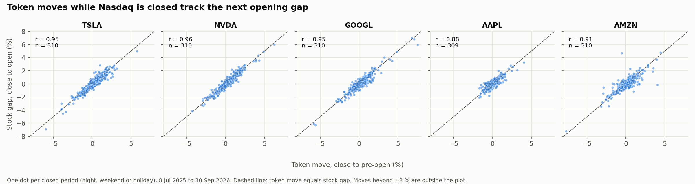
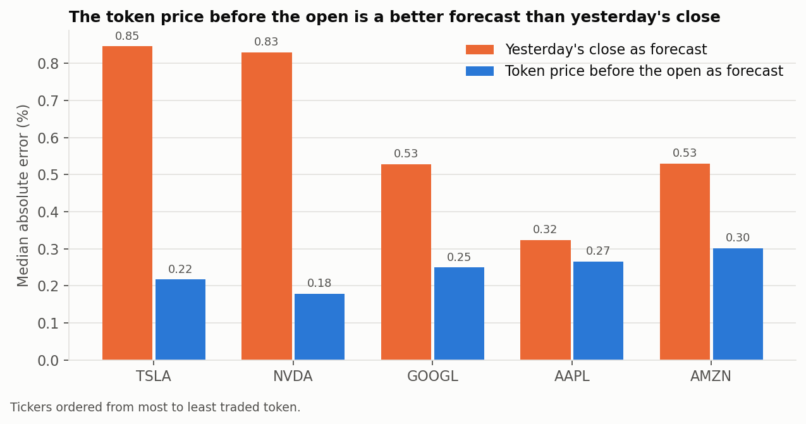
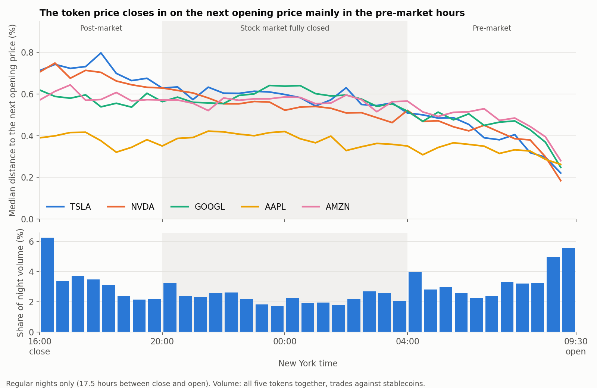
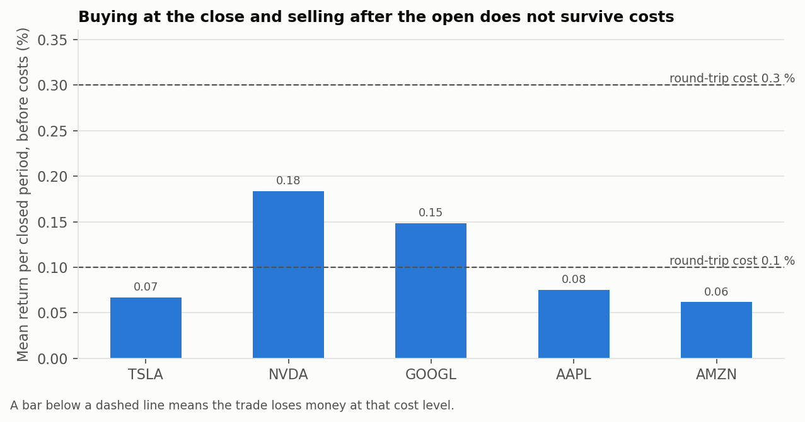

# Tokenized Stocks on Solana vs. Nasdaq: Price Behaviour Outside US Market Hours

**English** | [Deutsch](README.de.md)

**Tesla, Nvidia, Alphabet, Apple and Amazon · 8 July 2025 to 30 September 2026**

**Interactive dashboard (English and German):** https://tokenized-vs-nasdaq-stocks-after-hours-bpasxc8wni65acwxnmkscb.streamlit.app/

Nasdaq trades from 9:30 to 16:00 New York time. Tokenized versions of the same shares trade around the clock on the Solana blockchain. This project compares five tokenized stocks with their underlying shares and asks what happens to the token price while the stock exchange is closed: overnight, over weekends and over public holidays.

The project is written for two audiences: people from the stock market who have never used a blockchain, and people from crypto who want to know how closely these tokens follow the real market. A glossary for both is included in the dashboard.

## Key findings

- **The tokens track the shares closely while Nasdaq is open.** The mean absolute deviation is 0.17 % (Nvidia) to 0.29 % (Amazon).
- **The token market keeps moving while Nasdaq is closed**, which is 81 % of the time. The median price range is 1.0 % to 1.5 % in a regular night and 1.7 % to 2.5 % over a weekend.
- **The token price anticipates the opening price.** The correlation between the token's move during a closed period and the stock's opening gap is 0.88 to 0.96. Where the stock gapped by at least 0.5 %, the token had moved in the same direction in 95 % to 99 % of the cases.
- **The forecast is good, not perfect.** The token price before the open misses the real opening price by a median of 0.18 % to 0.30 %. This clearly beats yesterday's close for Tesla and Nvidia (0.85 % and 0.83 %), but only slightly for Apple (0.27 % against 0.32 %).
- **The adjustment happens late in the night.** For Tesla and Nvidia the distance to the next opening price falls from about 0.7 % at the close to about 0.5 % at 04:00, and then to about 0.2 % during the pre-market hours.
- **There is no profitable simple trade.** Buying at the close and selling after the open earns 0.06 % to 0.18 % per closed period before costs, about as much as the shares themselves gained overnight. At a round-trip cost of 0.3 % all five tokens lose money.
- **Liquidity matters.** The thinly traded Amazon token has the largest forecast error (0.30 %), the heavily traded Nvidia token the smallest (0.18 %).









## What is in this repository

| File | Content |
|---|---|
| `tokenized_vs_nasdaq_after_hours.ipynb` | The full analysis in 20 sections: selection, data quality, cleaning, seven questions, limitations, findings |
| `app.py` | Interactive dashboard (Streamlit and Plotly), in English and German, with filters, KPIs, a single-night view and a trading test with a cost slider |
| `sql/` | The two Dune queries behind the token data |
| `data/raw/` | Unchanged exports from Dune and Yahoo Finance |
| `data/clean/` | Cleaned tables written by the notebook |
| `figures/` | Six charts written by the notebook |

The dashboard runs online at https://tokenized-vs-nasdaq-stocks-after-hours.streamlit.app. To run it locally:

```bash
pip install -r requirements.txt
streamlit run app.py
```

## The seven questions

| # | Question | Answer | Notebook section |
|---|---|---|---|
| 1 | How close is the token to the stock during market hours? | Mean absolute deviation 0.17 % to 0.29 % | 12 |
| 2 | How far does the token move while Nasdaq is closed? | Median range 1.0 % to 1.5 % per night, 1.7 % to 2.5 % per weekend | 13 |
| 3 | Does the token predict the opening price? | Yes: correlation 0.88 to 0.96, median error 0.18 % to 0.30 % | 14 |
| 4 | Does buying at the close and selling after the open pay? | No: 0.06 % to 0.18 % before costs, negative at 0.3 % cost | 15 |
| 5 | Do thin tokens track worse than liquid ones? | Yes: forecast error and data gaps grow as volume falls | 16 |
| 6 | When during the night does the price adjust? | Mainly in the pre-market hours (04:00 to 09:30) | 17 |
| 7 | Does the token follow pre-market and post-market prices? | About as closely as during the session | 18 |

## The five assets

| Token | Solana mint address | Share | Ticker | Exchange | ISIN of the share |
|---|---|---|---|---|---|
| TSLAx | [`XsDoVfqeBukxuZHWhdvWHBhgEHjGNst4MLodqsJHzoB`](https://solscan.io/token/XsDoVfqeBukxuZHWhdvWHBhgEHjGNst4MLodqsJHzoB) | Tesla, Inc. | TSLA | Nasdaq | US88160R1014 |
| NVDAx | [`Xsc9qvGR1efVDFGLrVsmkzv3qi45LTBjeUKSPmx9qEh`](https://solscan.io/token/Xsc9qvGR1efVDFGLrVsmkzv3qi45LTBjeUKSPmx9qEh) | NVIDIA Corporation | NVDA | Nasdaq | US67066G1040 |
| GOOGLx | [`XsCPL9dNWBMvFtTmwcCA5v3xWPSMEBCszbQdiLLq6aN`](https://solscan.io/token/XsCPL9dNWBMvFtTmwcCA5v3xWPSMEBCszbQdiLLq6aN) | Alphabet Inc., Class A | GOOGL | Nasdaq | US02079K3059 |
| AAPLx | [`XsbEhLAtcf6HdfpFZ5xEMdqW8nfAvcsP5bdudRLJzJp`](https://solscan.io/token/XsbEhLAtcf6HdfpFZ5xEMdqW8nfAvcsP5bdudRLJzJp) | Apple Inc. | AAPL | Nasdaq | US0378331005 |
| AMZNx | [`Xs3eBt7uRfJX8QUs4suhyU8p2M6DoUDrJyWBa8LLZsg`](https://solscan.io/token/Xs3eBt7uRfJX8QUs4suhyU8p2M6DoUDrJyWBa8LLZsg) | Amazon.com, Inc. | AMZN | Nasdaq | US0231351067 |

- The five mint addresses are listed in the Solana Foundation's case study on xStocks [1].
- Exchange, ticker and ISIN of the shares: company profiles on StockAnalysis [6].
- The Alphabet token tracks the Class A share (GOOGL), not the Class C share (GOOG).

Token activity in the analysis window (trades against USD stablecoins on Solana DEXs, own Dune data):

| Token | Trades | Volume (million USD) | Half-hours with a price |
|---|---|---|---|
| TSLAx | 3,213,000 | 608.9 | 100.0 % |
| NVDAx | 3,950,211 | 537.7 | 99.9 % |
| GOOGLx | 767,548 | 103.3 | 97.1 % |
| AAPLx | 532,211 | 55.1 | 94.3 % |
| AMZNx | 313,809 | 37.2 | 87.0 % |

## Who issues these tokens

All five tokens are **xStocks**.

- **Issuer:** Backed Assets (JE) Limited, a private limited company in Jersey [2][3].
- **Backing:** each xStock is backed 1:1 by the underlying share. The shares are held with depositary institutions under a custody agreement [2]. According to the Solana case study, the issuer buys the real shares through brokers, deposits them with a regulated custodian and mints one token per share [1].
- **Rights:** holders of xStocks do not own the underlying shares and have no voting rights or claims on the underlying company [2]. A token gives price exposure, not shareholder status.
- **Availability:** xStocks are not available in the United States or to US persons, and not in Canada, the United Kingdom or Australia [2][3].
- **Launch:** xStocks launched on Solana on 30 June 2025 with more than 55 tokenized stocks and ETFs [1]. This date is the earliest possible start of the data.
- **Technology:** the tokens use Solana's Token-2022 standard (Token Extensions) [1].
- **Trading venues:** centralized exchanges (Kraken, Bybit) and decentralized exchanges on Solana such as Raydium, reachable through the aggregator Jupiter [1]. This project uses decentralized trades only.
- **Ownership of the issuer:** on 2 December 2025 Kraken announced that it had agreed to acquire Backed, the company behind xStocks [4].

xStocks is not the only issuer of tokenized stocks on Solana; Ondo Global Markets, for example, also offers tokenized US stocks there [10]. Other issuers are not part of this project.

## Why these five tokens

The tokens follow from two rules applied to every token whose Solana mint address starts with `Xs`, the prefix used by xStocks (monthly overview from Dune, 153 symbols, including a few unrelated tokens with the same prefix):

1. **Continuous trading:** at least 5,000 trades in every month from July 2025 to September 2026.
2. **Well-known single company without a crypto link**, so that readers outside the crypto scene can follow the comparison.

Rule 1 leaves ten tokens. Rule 2 removes two ETFs and three crypto-related companies.

| Token | Underlying | Lowest monthly trades | Volume (million USD) | Decision |
|---|---|---|---|---|
| SPYx | S&P 500 ETF | 110,739 | 2,684.0 | excluded: ETF |
| CRCLx | Circle | 56,522 | 1,187.8 | excluded: crypto-related |
| NVDAx | Nvidia | 96,190 | 750.9 | **selected** |
| TSLAx | Tesla | 164,118 | 730.5 | **selected** |
| QQQx | Nasdaq-100 ETF | 18,174 | 352.8 | excluded: ETF |
| MSTRx | Strategy | 43,736 | 310.5 | excluded: crypto-related |
| GOOGLx | Alphabet | 41,533 | 138.1 | **selected** |
| HOODx | Robinhood | 6,063 | 90.8 | excluded: crypto-related |
| AAPLx | Apple | 18,036 | 83.2 | **selected** |
| AMZNx | Amazon | 8,413 | 53.1 | **selected** |

Volume: all decentralized trades, July 2025 to September 2026. The export leaves out groups with fewer than 100 trades per month, venue and fee tier, so the figures are slightly too low. Excluding Robinhood, a broker with a large crypto business, is a judgement call.

Two candidates were considered first and dropped because they were hardly traded in 2025:

| Token | Trades in July 2025 | First month with at least 5,000 trades |
|---|---|---|
| MSFTx (Microsoft) | 0 | March 2026 |
| MCDx (McDonald's) | 102 | March 2026 |

## Market context

- **Solana dominates on-chain trading of tokenized stocks.** In June 2026 Solana accounted for about 94 % to 96 % of the tokenized stock trading volume across blockchains, according to SolanaFloor [7]. This is why the project uses Solana and not Ethereum.
- **The market grew strongly during the analysis window.** Monthly decentralized volume of all tokens in the overview query rose from 114 million USD in July 2025 to 2,290 million USD in June 2026 and 2,105 million USD in September 2026 (own Dune data).
- **Raydium is the main venue, but not for every token to the same degree.** Share of decentralized volume from July 2025 to August 2026 (own Dune data):

| Venue | TSLAx | NVDAx | GOOGLx | AAPLx | AMZNx |
|---|---|---|---|---|---|
| Raydium | 59.3 % | 72.9 % | 41.1 % | 55.6 % | 67.7 % |
| Byreal | 11.1 % | 9.9 % | 30.6 % | 20.5 % | 15.8 % |
| JupiterZ | 6.2 % | 6.1 % | 22.1 % | 14.9 % | 14.8 % |
| Orca (Whirlpool) | 16.3 % | 8.8 % | 3.3 % | 1.7 % | 0.6 % |
| Other | 7.1 % | 2.3 % | 2.9 % | 7.3 % | 1.1 % |

- **September 2026 changed the trading pattern.** A new venue, Raydium LaunchLab, took 12 % to 19 % of the volume of the five tokens, and the share of trades against tokens other than stablecoins or SOL rose from 4.9 % of volume in August to 38.5 % in September. The stablecoin prices used here were not visibly affected: prices from the other trades deviate from them by a median of 0.1 % to 0.2 %.

## Data

### Sources

| Data | Source | Detail |
|---|---|---|
| Token trades | Dune, table `dex_solana.trades` [8] | Two SQL queries, each exported once as CSV |
| Stock prices | Yahoo Finance via `yfinance` [9] | Hourly bars with pre-market and post-market, not dividend-adjusted, downloaded on 2 October 2026 |
| Market calendar | Derived from the stock data | The eight Nasdaq holidays of 2026 in the window match Nasdaq's published schedule [5] |

### Dune queries

| Query | Dune query ID | Output file |
|---|---|---|
| `xstocks_solana_30min_prices_by_quote` | 8887243 | `xstocks_solana_30min_by_quote_2025-06-30_2026-09-30.csv.gz` |
| `xstocks_solana_monthly_overview_fees` | 8887198 | `xstocks_solana_monthly_overview_fees.csv` |

The SQL files are in `sql/`: `xstocks_solana_30min_prices_by_quote.sql` and `xstocks_solana_monthly_overview_fees.sql`.

### Files in `data/raw/`

| File | Rows | Content |
|---|---|---|
| `xstocks_solana_30min_by_quote_2025-06-30_2026-09-30.csv.gz` | 276,486 | 30-minute prices and volume of the five tokens, split by quote type (stablecoin, SOL, other). Gzip-compressed to stay below GitHub's upload limit; pandas reads it directly |
| `xstocks_solana_monthly_overview_fees.csv` | 1,829 | Monthly trades and volume by venue for all tokens with the xStocks mint prefix. Basis of the token selection |
| `stocks_1h_prepost_2025-07-01_2026-09-30.csv` | 26,204 | Hourly stock bars of the five shares |

### Files in `data/clean/`

| File | Rows | Content |
|---|---|---|
| `tokens_30min_clean.csv` | 108,000 | One row per token and half-hour, with the stablecoin price, an outlier flag and labels for the market phase |
| `stocks_1h_clean.csv` | 26,204 | Hourly stock bars with session label and a flag for bad ticks outside market hours |
| `stocks_daily_open_close.csv` | 1,575 | Official open and close per share and trading day |
| `nights.csv` | 1,550 | One row per share and closed period: 310 periods times five shares |

### What Dune does not provide

Pool fees are missing. The column `fee_tier` of `dex_solana.trades` is filled for only 0.3 % of the volume in the overview, and not at all for Raydium. Trading costs in this project are therefore scenarios, not measurements.

## Method in short

- **Token price:** 30-minute volume-weighted average price of trades against USDC or USDT. A price that deviates by more than 5 % from the centred 24-hour rolling median is flagged as an outlier and not used (31 half-hours in total).
- **Analysis window:** starts on 8 July 2025. The Amazon token traded at unusable prices from 2 to 7 July 2025 (between about 180 and 3,300 USD on a few dollars of volume, against a real share price of about 225 USD).
- **Stock price:** the open is the open of the 9:30 bar, the close is the close of the last regular bar. On the two shortened trading days in the window the close is approximated.
- **Closed period:** the time between one close and the next open. The window contains 243 regular nights, 56 weekends and 11 breaks with a public holiday.
- **Time zones:** all timestamps are stored in UTC and converted to New York time for the market calendar, so daylight-saving changes are handled automatically.

## Data quality

| Check | Result |
|---|---|
| Duplicates in token and stock data | 0 |
| Missing values, prices of zero or below | 0 |
| Trading days per share in the window | 311, identical for all five |
| Days without an opening bar | 0 |
| Incomplete regular sessions | 2 (shortened trading days on 28 November and 24 December 2025) |
| Half-hours without a stablecoin trade | TSLAx 1, NVDAx 7, GOOGLx 615, AAPLx 1,216, AMZNx 2,804 of 21,600 each |
| Bad ticks flagged in post-market stock bars | 11 |

Gaps in the token data are rare during market hours and most frequent at weekends: for the Amazon token 3.6 % of the half-hours are missing during the session and 19.2 % at weekends.

## Limitations

- **Short history.** 15 months and 310 closed periods per share, of which only 56 are weekends and 11 include a holiday.
- **Average prices.** A 30-minute average is not a price at which a trade could have been executed. The trading test is an approximation.
- **Costs are scenarios.** Pool fees are not available from Dune, and slippage in thin pools is not modelled.
- **Decentralized trades only.** Trades on centralized exchanges such as Kraken are not included.
- **Pre-market and post-market prices** from Yahoo Finance contain bad ticks and missing bars. They are used only for question 7.
- **Dividends are not adjusted.** Apple, Alphabet and Nvidia paid five dividends each in the window, between 0.01 and 0.27 USD per share.
- **A market in development.** Volume grew strongly in 2026 and the trading pattern changed in September 2026. Results are averages over a changing market.
- **Selection choices.** The threshold of 5,000 trades per month and the exclusion of crypto-related companies are decisions, not facts.
- **Not investment advice.** This is a data analysis project.

## Sources

Accessed on 2 and 3 October 2026.

1. Solana Foundation, "xStocks: Tokenizing Equities on Solana" (case study): launch date, mint addresses, backing, token standard, trading venues. https://solana.com/news/case-study-xstocks
2. Kraken, "xStocks Risk Disclosure": issuer, backing, holder rights, restricted countries, risks. https://www.kraken.com/legal/xstocks
3. xStocks website: issuer and distribution entities, restriction for US persons. https://xstocks.fi/
4. Kraken Blog, "Kraken to acquire Backed", 2 December 2025. https://blog.kraken.com/news/backed-acquisition
5. Nasdaq, stock market holiday schedule and trading hours. https://www.nasdaq.com/market-activity/stock-market-holiday-schedule
6. StockAnalysis, company profiles with exchange, ticker and ISIN: [TSLA](https://stockanalysis.com/stocks/tsla/company/), [NVDA](https://stockanalysis.com/stocks/nvda/company/), [GOOGL](https://stockanalysis.com/stocks/googl/company/), [AAPL](https://stockanalysis.com/stocks/aapl/company/), [AMZN](https://stockanalysis.com/stocks/amzn/company/)
7. SolanaFloor, "Solana Tokenization Roundup: June 2026": Solana's share of tokenized stock trading volume. https://solanafloor.com/news/solana-tokenization-roundup-june-2026
8. Dune Docs, `dex_solana.trades`: table and column definitions. https://docs.dune.com/data-catalog/curated/dex-trades/solana/solana-dex-trades
9. yfinance documentation, `download`: parameters `prepost` and `auto_adjust`. https://ranaroussi.github.io/yfinance/reference/api/yfinance.download.html
10. CoinGecko, "What Are Tokenized Stocks and Top Platforms to Get Started": other issuers. https://www.coingecko.com/learn/what-are-tokenized-stocks

All figures marked "own Dune data" are computed from the files in `data/raw/`. The token selection, the data quality checks and the results of the seven questions are reproduced step by step in the notebook; the venue shares and the split by quote type are computed from the same files but are not part of the notebook.

## About this project

Code and texts were written with AI assistance and checked by me against the data. How I work with AI is described in my repository [local-ai-workflow](https://github.com/Amirhouschang/local-ai-workflow).

Feedback is welcome through GitHub issues.

## Rights

© 2026 Amirhoushang Rahmannejad. All rights reserved. You are welcome to read and review this project. Copying, modifying or redistributing it requires my written permission.
